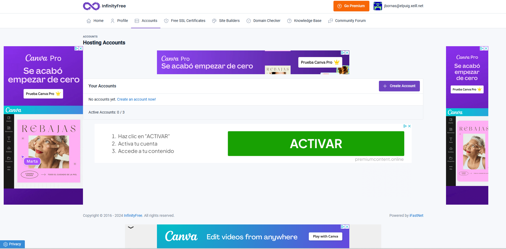

# HubSpot

## HubSpot es un servei que permet gestionar l'empresa i els seus integrants de una forma sencilla i rapida

### Hi ha que posar el nom de la teva empresa

.png)

### Aqui es posa el domini de l'empresa

.png)

### Es posa l'informació dels treballadors

.png)

### I per ultim aqui es gestiona l'empresa

.png)

# Netlify

## Netlify es un lloc on podem crear pagines web

### Hi ha que crearse un compte amb els mateixos pasos de HubSpot, Una vegada ho hagis fet, estaras a la pagina principal de Netlify, on ja podras crear pagines web

# InfinityFree

## InfinityFree es un host que et permet crear webs de forma gratuita

### Creem un compte amb els mateixos pasos de sempre, es ha dir, afegir un correu electronic i una contrasenya, una vegada fet aixó, ja hi estariem a la pagina principal d'InfinityFree

# AwardSpace

##

### Una vegada creem el compte d'AwardSpace he iniciem sesio ja estarem accedint a la pagina principal d'AwardSpace

# Wix

## Es un servei el cual ensotorga mes facilitat a l'hora de crear pagines web, ja que es fa utilitzant una IA (Inteligencia Artificial) 

### Una vegada has creat hi iniciat sesio es fara aquesta pregunta

### Una vegada fet aixo, ja arribaras a la pagina principal

